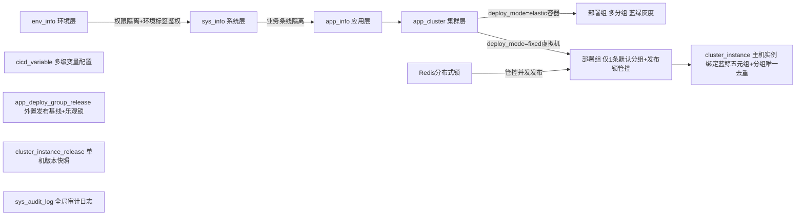
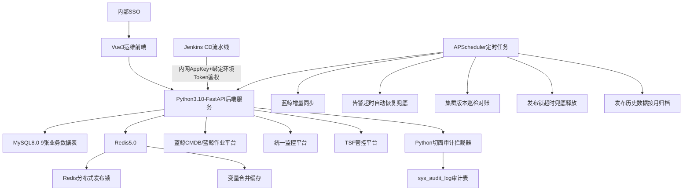

# 银行专属CICD\-CMDB 最终合规完整版落地实施方案（整改优化定稿）

## 0\. 全局核心前置约束（改版加固、不可修改、职责强边界）

### 0\.1 核心定位（保留原有边界\+新增风控约束）

1. **纯配置型CMDB，无任何部署执行能力**：仅存储投产元数据、提供API查询，拉包、传包、解压、启停、蓝鲸作业调用、TSF发布**全部由Jenkins CD流水线全权执行**

2. 数据源权责：自研CMDB唯一可信源；蓝鲸CMDB只读副本，单向同步：自研CMDB → 蓝鲸，禁止反向写入，同步模式可配置【强制覆盖/差异告警】双模式

3. 发布编排边界：应用上下游投产顺序、批次、串行调度，全权由Jenkins流水线管控，CMDB不干预、不编排、不调度

4. 并发发布约束：单部署组同一时间仅允许一场发布，内置发布锁管控，杜绝并发发布基线错乱、重复作业问题

5. 适配核心痛点：适配传统虚拟机**无版本固定包名**场景（`biz.tar`/`app.war`文件名永久固定、仅内容迭代），版本外置存储追溯，支持审计、对账、回滚

6. 合规底线：全操作可审计、接口分级鉴权、数据双层权限隔离，满足银行等保、内控投产要求

### 0\.2 全覆盖业务部署场景

- 包形态：压缩包不解压直放服务器 / 压缩包解压目录部署

- 发布策略：全量部署full / 增量部署incr

- 架构纳管：传统虚拟机（东方通/WeLogic/宝兰德/SpringBoot/Nginx）、TSF弹性容器集群

### 0\.3 层级架构（永久固定，新增发布锁、审计联动）



### 0\.4 配置优先级（逐级覆盖，严控个性化机器）

应用全局配置 \< 集群配置 \< 部署组配置 \< 单机实例配置

95%场景仅配置部署组，主机实例留空继承配置，仅特例主机做单机覆盖

### 0\.5 数据库全局通用规范（改版加固）

1. 字符集：utf8mb4，排序规则：utf8mb4\_unicode\_ci

2. 全表逻辑删除：is\_deleted tinyint DEFAULT 0，无物理外键，适配分布式架构

3. **全业务唯一索引强制追加is\_deleted**，解决逻辑删除后同名业务键无法重建问题

4. 核心查询建立联合索引，万级主机高性能查询；发布、主机表新增业务去重索引

5. 大表归档规则：app\_deploy\_group\_release、cluster\_instance\_release按月分区，留存12个月在线数据，历史数据迁移归档库

---

## 1\. 全套数据库定稿建表语句（10张表，含索引、字段、约束全整改完毕，可直接执行）

整改说明：全部优化唯一索引、新增发布锁、乐观锁、去重约束，新增合规审计表，兼容旧数据无缝迁移

### 表1：env\_info 环境信息表

```sql
CREATE TABLE `env_info` (
  `id` bigint NOT NULL AUTO_INCREMENT COMMENT '主键ID',
  `env_code` varchar(32) NOT NULL COMMENT '环境编码 dev/test/staging/prod',
  `env_name` varchar(64) NOT NULL COMMENT '环境名称',
  `env_tags` varchar(255) DEFAULT '' COMMENT '权限标签，逗号分隔，控制人员环境可见性+后端鉴权',
  `is_deleted` tinyint NOT NULL DEFAULT '0' COMMENT '0正常 1删除',
  PRIMARY KEY (`id`),
  UNIQUE KEY `uk_env_code` (`env_code`,`is_deleted`)
) ENGINE=InnoDB DEFAULT CHARSET=utf8mb4 COMMENT='环境信息';
```

### 表2：sys\_info 业务系统表（新增，区分研发/运维双负责人）

```sql
CREATE TABLE `sys_info` (
  `id` bigint NOT NULL AUTO_INCREMENT COMMENT '主键',
  `sys_code` varchar(64) NOT NULL COMMENT '系统唯一编码',
  `sys_name` varchar(128) NOT NULL COMMENT '系统名称',
  `env_code` varchar(32) NOT NULL COMMENT '所属环境',
  `dev_owner` varchar(64) DEFAULT '' COMMENT '研发负责人',
  `ops_owner` varchar(64) DEFAULT '' COMMENT '运维负责人',
  `remark` varchar(255) DEFAULT '' COMMENT '备注',
  `is_deleted` tinyint NOT NULL DEFAULT '0' COMMENT '0正常 1删除',
  PRIMARY KEY (`id`),
  UNIQUE KEY `uk_sys_code` (`sys_code`,`env_code`,`is_deleted`)
) ENGINE=InnoDB DEFAULT CHARSET=utf8mb4 COMMENT='业务系统信息';
```

### 表3：app\_info 业务应用表（新增 sys_id 归属 + 双负责人字段）

```sql
CREATE TABLE `app_info` (
  `id` bigint NOT NULL AUTO_INCREMENT COMMENT '主键',
  `app_code` varchar(64) NOT NULL COMMENT '应用唯一编码',
  `sys_id` bigint DEFAULT '0' COMMENT '归属系统ID',
  `app_name` varchar(128) NOT NULL COMMENT '应用名称',
  `app_type` varchar(32) NOT NULL COMMENT '类型：springboot、nginx、tongweb、weblogic、tsf-service',
  `repo_url` varchar(255) DEFAULT '' COMMENT '代码仓库地址',
  `artifact_repo` varchar(255) DEFAULT '' COMMENT '制品库地址',
  `owner` varchar(64) DEFAULT '' COMMENT '应用负责人',
  `dev_owner` varchar(64) DEFAULT '' COMMENT '研发负责人',
  `ops_owner` varchar(64) DEFAULT '' COMMENT '运维负责人',
  `server_port` int DEFAULT '0' COMMENT '默认业务端口',
  `management_port` int DEFAULT '0' COMMENT '监控端口',
  `proc_name` varchar(128) DEFAULT '' COMMENT '进程名称',
  `base_jvm_opts` varchar(1024) DEFAULT '' COMMENT '应用全局JVM模板',
  `log_base_dir` varchar(255) DEFAULT '' COMMENT '日志根目录',
  `default_bk_biz_id` bigint DEFAULT '0' COMMENT '默认蓝鲸业务ID，实例自动继承',
  `is_deleted` tinyint NOT NULL DEFAULT '0',
  PRIMARY KEY (`id`),
  UNIQUE KEY `uk_app_code` (`app_code`,`is_deleted`)
) ENGINE=InnoDB DEFAULT CHARSET=utf8mb4 COMMENT='业务应用信息';
```

### 表4：app\_cluster 应用集群表

```sql
CREATE TABLE `app_cluster` (
  `id` bigint NOT NULL AUTO_INCREMENT COMMENT '主键',
  `env_code` varchar(32) NOT NULL COMMENT '环境编码',
  `app_code` varchar(64) NOT NULL COMMENT '应用编码',
  `cluster_code` varchar(64) NOT NULL COMMENT '集群唯一编码',
  `cluster_name` varchar(128) NOT NULL COMMENT '集群名称',
  `deploy_mode` varchar(32) NOT NULL COMMENT 'fixed固定主机 | elastic弹性容器',
  `tsf_cluster_id` varchar(128) DEFAULT '' COMMENT 'TSF集群ID',
  `namespace` varchar(64) DEFAULT '' COMMENT '容器命名空间',
  `labels` varchar(512) DEFAULT '' COMMENT '灰度发布标签',
  `status` tinyint NOT NULL DEFAULT '1' COMMENT '1允许发布 0禁用投产',
  `is_deleted` tinyint NOT NULL DEFAULT '0',
  PRIMARY KEY (`id`),
  UNIQUE KEY `uk_env_app_cluster` (`env_code`,`app_code`,`cluster_code`,`is_deleted`),
  KEY `idx_app_code` (`app_code`)
) ENGINE=InnoDB DEFAULT CHARSET=utf8mb4 COMMENT='应用集群';
```

### 表5：app\_deploy\_group 部署组核心配置表（新增发布锁全套字段）

```sql
CREATE TABLE `app_deploy_group` (
  `id` bigint NOT NULL AUTO_INCREMENT COMMENT '主键',
  `env_code` varchar(32) NOT NULL,
  `app_code` varchar(64) NOT NULL,
  `cluster_id` bigint NOT NULL COMMENT '关联集群ID',
  `group_code` varchar(64) NOT NULL COMMENT '分组编码 default-group/group-a/group-b/gray',
  `group_name` varchar(128) NOT NULL,
  `deploy_group_id` varchar(128) DEFAULT '' COMMENT 'TSF平台部署组ID',
  `group_type` varchar(16) NOT NULL COMMENT 'fixed / elastic',
  `status` tinyint NOT NULL DEFAULT '1',

  -- 【虚拟机流水线核心字段】适配固定tar/war无版本包场景
  `artifact_file_name` varchar(128) DEFAULT '' COMMENT '服务器固定包名：biz.tar/app.war，文件名永久不带版本',
  `deploy_path` varchar(255) DEFAULT '' COMMENT '应用部署根目录',
  `deploy_user` varchar(64) DEFAULT '' COMMENT '发布执行账号',
  `deploy_strategy` varchar(16) DEFAULT 'full' COMMENT 'full全量部署 | incr增量部署',
  `unpack_flag` char(1) DEFAULT 'Y' COMMENT 'Y解压部署 N压缩包直接放置不解压',
  `jvm_opts` varchar(1024) DEFAULT '' COMMENT '分组JVM参数(虚拟机/TSF通用)',
  `health_check_url` varchar(255) DEFAULT '' COMMENT '应用健康检查地址',
  `start_script` varchar(512) DEFAULT '' COMMENT '服务启动脚本',
  `stop_script` varchar(512) DEFAULT '' COMMENT '服务停止脚本',

  -- TSF弹性容器专属字段
  `cpu_request` varchar(32) DEFAULT '',
  `cpu_limit` varchar(32) DEFAULT '',
  `mem_request` varchar(32) DEFAULT '',
  `mem_limit` varchar(32) DEFAULT '',
  `replicas` int DEFAULT '0',
  `tsf_traffic_weight` int DEFAULT '0' COMMENT 'TSF灰度流量权重',
  `update_type` int DEFAULT '0' COMMENT '0立即更新 1滚动更新',

  -- 传统中间件专属字段
  `middleware_domain` varchar(128) DEFAULT '' COMMENT '中间件域名称',
  `middleware_cluster_name` varchar(128) DEFAULT '' COMMENT '中间件内部集群名',
  `admin_url` varchar(255) DEFAULT '' COMMENT '中间件管理控制台地址',
  `package_type` varchar(32) DEFAULT '' COMMENT 'jar/war/tar',

  -- 新增：发布并发锁全套字段（防并发发布、基线错乱）
  `lock_status` tinyint NOT NULL DEFAULT 0 COMMENT '0空闲 1发布中',
  `lock_trace_id` varchar(128) DEFAULT '' COMMENT '绑定本次发布全局traceId',
  `lock_expire_time` datetime DEFAULT NULL COMMENT '锁超时自动释放时间',

  `is_deleted` tinyint NOT NULL DEFAULT '0',
  PRIMARY KEY (`id`),
  -- 整改后带逻辑删除唯一索引，支持误删重建同名分组
  UNIQUE KEY `uk_group_rel` (`env_code`,`app_code`,`cluster_id`,`group_code`,`is_deleted`),
  KEY `idx_cluster_id` (`cluster_id`)
) ENGINE=InnoDB DEFAULT CHARSET=utf8mb4 COMMENT='部署分组';
```

### 表6：cluster\_instance 主机实例表（新增分组主机双去重索引，防重复下发作业）

```sql
CREATE TABLE `cluster_instance` (
  `id` bigint NOT NULL AUTO_INCREMENT COMMENT '主键',
  `deploy_group_id` bigint NOT NULL COMMENT '归属部署组ID',
  `instance_ip` varchar(39) DEFAULT '' COMMENT '内网IP',
  `ssh_port` int DEFAULT '22',

  -- 蓝鲸五元组（流水线调用作业平台必填核心）
  `bk_biz_id` bigint DEFAULT '0' COMMENT '蓝鲸业务ID',
  `bk_host_id` bigint DEFAULT '0' COMMENT '蓝鲸主机唯一ID（作业首选主键）',
  `bk_cloud_id` int DEFAULT '0' COMMENT '蓝鲸云区域ID',
  `bk_module_id` bigint DEFAULT '0',
  `bk_inner_ip` varchar(39) DEFAULT '',

  -- 单机差异化覆盖配置（优先级高于部署组，特例使用）
  `deploy_user` varchar(64) DEFAULT '' COMMENT '单机发布账号',
  `deploy_path` varchar(255) DEFAULT '' COMMENT '单机独立部署目录',
  `instance_tags` varchar(255) DEFAULT '' COMMENT '分批发布标签 group-a/group-b',
  `instance_status` tinyint NOT NULL DEFAULT '1' COMMENT '1正常可用 0维护禁用，流水线强制过滤',

  `start_script` varchar(512) DEFAULT '',
  `stop_script` varchar(512) DEFAULT '',
  `health_check_url` varchar(255) DEFAULT '',
  `is_deleted` tinyint NOT NULL DEFAULT '0',
  PRIMARY KEY (`id`),
  KEY `idx_deploy_group_id` (`deploy_group_id`),
  KEY `idx_host_id` (`bk_host_id`),
  -- 整改：分组内蓝鲸主机唯一，杜绝重复绑定
  UNIQUE KEY `uk_group_host` (`deploy_group_id`, `bk_host_id`, `is_deleted`),
  -- 兜底：无蓝鲸ID场景，IP+分组唯一去重
  UNIQUE KEY `uk_group_ip` (`deploy_group_id`, `instance_ip`, `is_deleted`)
) ENGINE=InnoDB DEFAULT CHARSET=utf8mb4 COMMENT='主机实例信息';
```

### 表7：cicd_variable 多级变量配置表（整改唯一索引）

```sql
CREATE TABLE `cicd_variable` (
  `id` bigint NOT NULL AUTO_INCREMENT,
  `env_code` varchar(32) NOT NULL,
  `app_code` varchar(64) NOT NULL,
  `cluster_code` varchar(64) DEFAULT '',
  `group_code` varchar(64) DEFAULT '',
  `instance_id` bigint DEFAULT '0',
  `var_key` varchar(128) NOT NULL,
  `var_value` text COMMENT '变量值(明文)',
  `remark` varchar(255) DEFAULT '',
  `is_deleted` tinyint NOT NULL DEFAULT '0',
  PRIMARY KEY (`id`),
  -- 整改：追加is_deleted，删除后可重建同名变量
  UNIQUE KEY `uk_var_key` (`env_code`,`app_code`,`cluster_code`,`group_code`,`instance_id`,`var_key`,`is_deleted`)
) ENGINE=InnoDB DEFAULT CHARSET=utf8mb4 COMMENT='CICD环境变量配置';
```

### 表8：app\_deploy\_group\_release 发布基线表（新增乐观锁，解决is\_current并发脏数据）

```sql
CREATE TABLE `app_deploy_group_release` (
  `id` bigint NOT NULL AUTO_INCREMENT,
  `env_code` varchar(32) NOT NULL,
  `app_code` varchar(64) NOT NULL,
  `cluster_id` bigint NOT NULL,
  `group_code` varchar(64) NOT NULL,
  `build_no` varchar(64) DEFAULT '' COMMENT 'Jenkins构建编号，唯一锁定本次制品',
  `git_commit` varchar(64) DEFAULT '' COMMENT '代码提交快照',
  `artifact_version` varchar(128) NOT NULL COMMENT '自定义投产版本备注：账务补丁20260619',
  `release_user` varchar(64) NOT NULL,
  `release_time` datetime NOT NULL DEFAULT CURRENT_TIMESTAMP,
  `release_status` varchar(16) NOT NULL COMMENT 'success/fail/rollback',
  `is_current` tinyint NOT NULL DEFAULT '0' COMMENT '1=当前生效基线',
  `version` bigint NOT NULL DEFAULT 0 COMMENT '乐观锁版本号，防控并发更新',
  `remark` varchar(500) DEFAULT '',
  `is_deleted` tinyint NOT NULL DEFAULT '0',
  PRIMARY KEY (`id`),
  KEY `idx_group_rel` (`env_code`,`app_code`,`cluster_id`,`group_code`)
) ENGINE=InnoDB DEFAULT CHARSET=utf8mb4 COMMENT='发布基线版本';
```

### 表9：cluster\_instance\_release 单机实例发布快照表

```sql
CREATE TABLE `cluster_instance_release` (
  `id` bigint NOT NULL AUTO_INCREMENT,
  `instance_id` bigint NOT NULL COMMENT '主机实例ID',
  `cluster_release_id` bigint NOT NULL COMMENT '关联基线记录ID',
  `instance_ip` varchar(39) DEFAULT '',
  `build_no` varchar(64) NOT NULL COMMENT '主机落地构建号',
  `current_version` varchar(128) NOT NULL,
  `deploy_time` datetime NOT NULL DEFAULT CURRENT_TIMESTAMP,
  `deploy_result` varchar(16) NOT NULL COMMENT '成功/失败',
  `is_deleted` tinyint NOT NULL DEFAULT '0',
  PRIMARY KEY (`id`),
  KEY `idx_instance_id` (`instance_id`)
) ENGINE=InnoDB DEFAULT CHARSET=utf8mb4 COMMENT='单机实例发布快照';
```

### 表10：sys\_audit\_log 全局操作审计表（银行等保强制新增，全链路留痕）

```sql
CREATE TABLE `sys_audit_log` (
  `id` bigint NOT NULL AUTO_INCREMENT COMMENT '主键',
  `operator` varchar(64) NOT NULL COMMENT '操作人账号',
  `operation` varchar(32) NOT NULL COMMENT '操作类型 INSERT/UPDATE/DELETE/PUBLISH/SYNC',
  `target_table` varchar(64) NOT NULL COMMENT '操作数据表',
  `target_biz_key` varchar(128) NOT NULL COMMENT '业务唯一标识(主键/应用编码/分组编码)',
  `old_data` json DEFAULT NULL COMMENT '变更前完整数据',
  `new_data` json DEFAULT NULL COMMENT '变更后完整数据',
  `request_ip` varchar(64) COMMENT '操作客户端IP',
  `trace_id` varchar(128) DEFAULT '' COMMENT '全链路追踪ID/发布traceId',
  `create_time` datetime NOT NULL DEFAULT CURRENT_TIMESTAMP,
  PRIMARY KEY (`id`),
  INDEX `idx_create_time` (`create_time`),
  INDEX `idx_operator` (`operator`),
  INDEX `idx_target_biz_key` (`target_biz_key`)
) ENGINE=InnoDB DEFAULT CHARSET=utf8mb4 COMMENT='全量操作审计日志（永久留存不可删）';
```

---

## 2\. 前后端整体架构改版设计

### 2\.1 技术栈选型（无变更，新增组件能力）

#### 前端（运维管理端）

- 核心框架：Vue3 \+ Vite

- 组件库：Element Plus

- 工具依赖：Axios接口请求、Element Plus组件、Pinia状态管理

- 页面规则：表单联动显隐、fixed集群限制仅创建1条默认分组、生产环境标签过滤

#### 后端（数据服务端）

- 核心框架：Python3.12 + FastAPI + SQLAlchemy2.0 + MySQL8.0（异步ORM适配银行生产）

- 内置组件：APScheduler定时任务（替代Quartz）、httpx三方异步对接、Redis5.0分布式锁、AOP切面审计拦截

- 核心特性：纯Python异步服务、无发布执行代码、纯CRUD+API转发、双层数据权限、接口分级鉴权、Redis5.0缓存管控、适配银行内网容器化部署

### 2\.2 后端六大业务模块（新增审计模块，能力升级）

|模块名称|核心职责|硬性校验规则|
|---|---|---|
|基础资源模块|环境/应用/集群/部署组CRUD、发布锁状态管控|fixed虚拟机集群仅允许1条default\-group；发布中分组禁止新增发布|
|主机实例模块|主机CRUD、批量绑定分组、蓝鲸字段维护、维护状态过滤|分组内主机不可重复绑定；流水线自动过滤维护态主机|
|变量配置模块|多级变量维护、变量合并、Redis缓存管控|遵循层级优先级合并；变更自动清理缓存|
|版本基线模块|流水线版本回写、版本一致性巡检、基线并发管控、归档调度|事务\+乐观锁管控is\_current；巡检过滤发布中主机；大表按月归档|
|外部联动模块|蓝鲸单向双模式同步、监控告警启停、流水线精细化鉴权对接|支持强制覆盖/差异告警；Token绑定env_code+app_code；同步全量审计|
|安全审计模块|AOP自动审计、操作留痕、权限校验|所有变更必留新旧数据；双层权限拦截|

### 2\.3 全局架构流程图（改版完整版）



### 2\.4 银行生产级安全内控规范（改版增强）

1. 登录鉴权：对接内网统一SSO，账号操作全留痕

2. **双层数据权限**：①app\_code业务条线行权限隔离 ②env\_tags环境权限隔离，开发人员禁止访问生产环境，后端强制校验

3. 接口鉴权：流水线Token绑定env\_code\+app\_code，禁止全局通用Token，杜绝横向越权

4. 敏感数据管控：管理端按权限展示，操作全量审计留痕

5. 操作审计：全量变更、同步、告警、发布操作永久留存，不可物理删除

---

## 3\. 全套REST API接口定稿（全部加固幂等、过滤、入参、缓存规则）

接口规范：GET查询、POST新增、PUT编辑、DELETE逻辑删除；流水线接口全部Token内网鉴权，Token绑定应用\+环境

### 3\.1 前端运维管理接口（无变更，底层新增审计、权限校验）

#### 环境管理

- GET /api/v1/admin/env/list：分页查询环境（前端按env\_tags过滤，后端校验权限）

- POST /api/v1/admin/env/save：新增/编辑环境

- PUT /api/v1/admin/env/remove：逻辑删除环境

#### 应用管理

- GET /api/v1/admin/app/list：应用分页列表

- POST /api/v1/admin/app/save：新增/编辑应用

- GET /api/v1/admin/app/detail：应用详情

- PUT /api/v1/admin/app/remove：逻辑删除应用

#### 集群管理

- GET /api/v1/admin/cluster/list：按环境\+应用筛选集群

- POST /api/v1/admin/cluster/save：新增集群

- PUT /api/v1/admin/cluster/status：启用/禁用集群发布

- PUT /api/v1/admin/cluster/remove：逻辑删除集群

#### 部署组管理

- GET /api/deploy\-group/list：部署组分页查询

- POST /api/deploy\-group/save：新增分组（内置fixed分组数量校验）

- PUT /api/deploy\-group/save：修改发布配置、包名、部署策略（变更自动清理变量缓存\+写入审计）

- PUT /api/deploy\-group/remove：逻辑删除分组

#### 主机实例管理

- GET /api/v1/admin/instance/list：主机筛选查询

- POST /api/v1/admin/instance/save：新增/编辑主机

- PUT /api/v1/admin/instance/bind-group：批量主机绑定部署组（高频运维）

- PUT /api/v1/admin/instance/status：主机维护/正常状态切换

#### 多级变量管理

- GET /api/v1/admin/variable/list：层级变量查询

- POST /api/v1/admin/variable/save：新增/编辑变量（清理对应缓存）

- DELETE /api/v1/admin/variable/remove：删除变量

- GET /api/v1/admin/variable/merge：合并全层级变量，输出最终渲染变量（优先读取Redis缓存）

#### 版本审计接口

- GET /api/v1/admin/release/baseline/list：发布基线历史查询

- GET /api/v1/admin/release/check\-consistency：集群版本一致性对账（自动过滤lock\_status=1发布中分组）

### 3\.2 Jenkins流水线专属对外API（全量改版加固，核心3接口）

#### 接口1：发布前置\-告警管控\+发布锁抢占（新增幂等、traceId、锁管控）

POST /api/v1/cd/release\-before

标准入参（新增全局发布追踪ID，实现幂等防重试）

```json
{
  "release_trace_id": "UUID-20260619-001",
  "env_code": "prod",
  "app_code": "loan-core",
  "group_code": "default-group",
  "release_no": "J-20260619.1",
  "timeout_minute": 60
}
```

业务动作：

1. 幂等校验：已存在traceId工单直接返回成功，不重复执行逻辑

2. 校验部署组lock\_status，空闲则抢占发布锁，写入traceId、锁超时时间

3. 记录发布工单、调用监控屏蔽告警、创建绑定traceId的超时自动恢复定时任务

#### 接口2：获取全量发布配置（流水线核心消费接口，新增维护主机强制过滤）

POST /api/v1/cd/get\-deploy\-target

入参：env\_code、app\_code、cluster\_code、group\_code

后端强制过滤：instance\_status=1、is\_deleted=0 正常主机，剔除维护摘除节点

统一返回参数：固定包名、部署路径、执行账号、全量/增量策略、解压标识、JVM参数(通用)、启停脚本、健康检查URL、合并变量

分支返回：fixed模式返回蓝鲸五元组主机清单+单机差异化字段；elastic模式返回TSF容器资源参数(含update_type更新策略)

#### 接口3：发布后置\-版本回写\+告警恢复\+锁释放（重构入参，支持单机结果，基线规则明确）

POST /api/v1/cd/release\-after

标准定稿入参

```json
{
  "release_trace_id": "UUID-20260619-001",
  "env_code": "prod",
  "app_code": "loan-core",
  "cluster_id": 10,
  "group_code": "default-group",
  "build_no": "J-20260619.1",
  "artifact_version": "账务补丁20260619",
  "release_user": "release-op",
  "overall_status": "partial_success",
  "instances": [
    {
      "instance_id": 1001,
      "instance_ip": "10.20.30.1",
      "deploy_result": "success"
    },
    {
      "instance_id": 1002,
      "instance_ip": "10.20.30.2",
      "deploy_result": "fail"
    }
  ]
}
```

业务规则：

1. 幂等校验：同一traceId仅写入一次数据

2. 批量写入单机实例发布快照，留存每台主机投产结果

3. 基线更新规则：overall\_status=success/partial\_success，事务清空旧is\_current，更新新基线生效；整体fail不切换生效基线

4. 释放部署组发布锁、主动恢复业务告警、完结发布工单

### 3\.3 蓝鲸联动同步接口（新增同步模式配置）

- POST /api/v1/admin/sync/blueking/manual：手动触发CMDB→蓝鲸拓扑同步，支持传入mode：cover强制覆盖/warn差异告警

- GET /api/v1/admin/sync/blueking/log：查询同步执行日志，同步差异写入审计表

---

## 4\. 传统固定文件名tar/war包 完整投产闭环流程（改版边缘场景全覆盖）

### 4\.1 一次性前置配置（永久复用）

1. 部署组维护固定参数：artifact\_file\_name=biz\.tar、deploy\_path=/data/app/biz、deploy\_strategy=full、unpack\_flag=Y

2. Excel批量导入主机IP、蓝鲸五元组，批量绑定至当前部署组，系统自动校验主机不重复

3. 流水线固定读取部署组配置，无需每次修改参数

### 4\.2 Jenkins流水线标准执行全流程

1. 流水线生成唯一release\_trace\_id，调用前置接口，抢占发布锁、上报发布范围、屏蔽业务告警，幂等防重试

2. 流水线调用获取配置接口，后端过滤维护主机，下发有效部署参数\+变量

3. **流水线独立执行所有部署动作**：制品库下载biz\.tar → 调用蓝鲸作业传包至服务器 → 根据策略清空/保留目录 → 根据标识解压/不解压 → 启停服务 → 健康探测

4. 流水线携带单机成败结果，调用后置接口，回写build号、版本、单机构态，更新集群基线、释放发布锁、恢复告警

5. 流水线失联超时，APScheduler定时任务自动兜底释放锁、恢复告警、完结工单（全栈统一替换为Python定时组件，彻底剔除Java Quartz依赖）

### 4\.3 版本追溯\+回滚\+巡检容错方案

1. 物理包biz\.tar永久同名迭代覆盖，版本外置存储在发布基线表，全链路可审计

2. 回滚标准化：回滚等同于新建发布，复用全套前置加锁、后置更新基线流程，无需单独开发接口

3. 基线并发防护：更新基线采用数据库事务\+version乐观锁，杜绝多条is\_current=1脏数据

4. 定时巡检容错：过滤lock\_status=1发布中分组，过渡态版本不一致不告警，仅校验稳态主机版本

### 4\.4 包适配规则（无变更）

- 中间件war直放：unpack\_flag=N，包直接放入autodeploy目录，不解压

- tar业务包部署：unpack\_flag=Y，流水线执行解压目录部署

- 全量full：停止服务清空业务目录；增量incr：仅覆盖业务资源，保留配置文件

---

## 5\. 全局落地红线\+运维合规细则

### 5\.1 核心职责红线（严禁越界）

1. CMDB仅存配置、查数据、联动告警、管控状态，绝不执行拉包、传包、启停、解压等部署动作

2. 集群规则：fixed固定主机集群仅支持1条default\-group；elastic容器集群支持多分组灰度

3. 发布编排：上下游发布顺序、批次、串行调度，全权由Jenkins流水线管控

### 5\.2 蓝鲸同步运维细则

1. 双同步模式可后台配置：cover强制覆盖CMDB数据、warn差异告警不覆盖

2. 同步差异、同步结果全部写入审计日志，支持溯源核对

### 5\.3 缓存运维细则

1. 多级变量合并启用Redis缓存，key：var\_merge:\{env\}:\{app\}:\{cluster\}:\{group\}

2. 任意变量、部署组配置变更，自动销毁对应缓存，保证配置实时生效

### 5\.4 数据归档运维细则

1. 发布基线、主机快照按月分区，在线库留存12个月数据

2. 超期数据定时迁移归档历史库，业务库仅保留有效投产数据，控制库容量

### 5\.5 发布锁兜底细则

1. 发布锁绑定traceId\+超时时间，超时自动释放

2. 定时任务定时扫描过期锁，强制重置lock\_status，避免死锁阻塞发布

---

## 6\. 改造落地优先级清单（上线分级执行）

|优先级|改造项|上线约束|
|---|---|---|
|P0 阻断级（上线必改）|全表逻辑删除复合索引整改、主机分组双去重索引、新增审计表、发布锁字段|规避生产重复作业、删后无法重建、合规不通过核心风险|
|P1 稳定级（迭代必改）|基线乐观锁\+事务并发管控、流水线接口幂等改造、维护主机过滤、后置接口单机结果入参改造、Python后端双层权限校验|解决并发基线错乱、网络重试故障、越权访问问题|
|P2 优化级（后期迭代）|变量Redis缓存、大表按月归档、蓝鲸双模式同步、巡检过滤发布中主机|优化数据库压力、提升运维便捷度、减少无效告警|

## 7\. Python3.12后端生产配套资源（直接落地，内网私有化适配）

### 7\.1 项目根目录 requirements.txt 生产依赖（适配Python3.12，兼容Redis5.0、MySQL8.0）

```python
# 核心web框架
fastapi==0.104.1
uvicorn[standard]==0.24.0
# 数据库ORM 适配MySQL8.0异步驱动
sqlalchemy==2.0.23
asyncmy==0.2.9
# Redis5.0 客户端、分布式锁工具
redis==4.6.0
# 定时任务 替代Quartz 集群防重复执行
APScheduler==3.10.4
# 内网三方异步请求
httpx==0.25.2
# 校验、序列化、权限工具
pydantic==2.4.2
# 日志、环境配置
python-dotenv==1.0.0
loguru==0.7.2
# Excel导入导出
openpyxl==3.1.2
```

### 7\.2 后端核心环境配置 \.env生产配置文件

```ini
# 服务配置
SERVER_HOST=0.0.0.0
SERVER_PORT=8000
ENV_MODE=prod
# MySQL8.0配置
DB_HOST=127.0.0.1
DB_PORT=3306
DB_USER=cicd_admin
DB_PWD=xxxxxxx
DB_NAME=bank_cicd_cmdb
# Redis5.0配置
REDIS_HOST=127.0.0.1
REDIS_PORT=6379
REDIS_PASSWORD=
# SSO对接配置（暂未启用）
SSO_API_URL=http://sso-inner.bank.com/api
# 流水线鉴权配置（暂未启用）
PIPELINE_TOKEN_PREFIX=bank-cicd-token
```

### 7\.3 Redis5\.0分布式发布锁核心适配规则（兼容低版本Redis，适配本业务锁逻辑）

1. 禁用Redis6\+Redlock高阶语法，采用SET NX EX原生指令，兼容Redis5\.0内核指令

2. 锁Key规范：**lock:deploy:\{env\_code\}:\{app\_code\}:\{group\_code\}**

3. 锁Value绑定release\_trace\_id，防止跨发布误删他人锁，保证幂等解绑

4. 兜底机制：业务手动释放优先、过期时间自动失效、定时巡检批量回收过期僵尸锁三层防护

### 7\.4 SQLAlchemy2\.0全局ORM规范（贴合库表字段，统一开发标准）

1. 全局基类统一内置is\_deleted、create\_time、update\_time通用字段，全局逻辑删除统一拦截

2. 基线更新强制使用ORM乐观锁version字段，事务原子化更新is\_current状态，杜绝多条生效基线

3. 新增、修改、删除全局切面拦截，自动组装old\_data/new\_data，自动写入sys\_audit\_log审计表，无需业务编码

### 7\.5 Vue3前端配套依赖说明

```json
{
  "dependencies": {
    "vue": "^3.5.0",
    "vite": "^8.0.0",
    "element-plus": "^2.14.0",
    "axios": "^1.18.0",
    "pinia": "^3.0.0",
    "vue-router": "^4.6.0"
  }
}
```

> （注：部分内容可能由 AI 生成）
